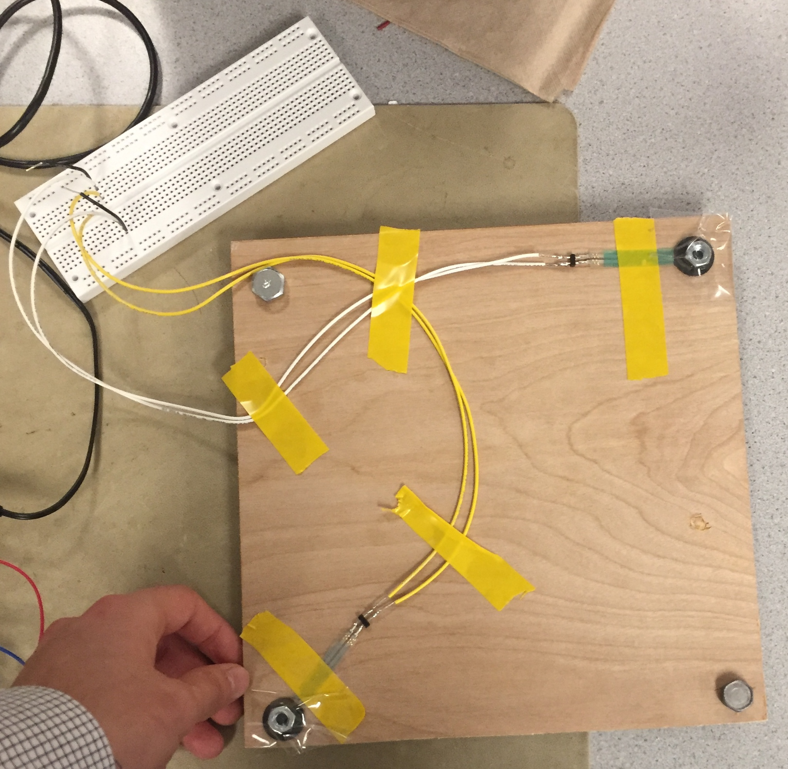

# Dance Dance Evolution

### Real Time Beat Detection, Audio Buffering, and User Input Using the PIC32

*Designed for ECE 4760: Digital Systems Design Using Microcontrollers*

*Drew Dunne (asd222) & Michael Solomentsev (mys29)*

---

### Background

We designed a version of the traditional arcade game 'Dance Dance Revolution' that live synthesizes dance instructions from any audio source using the PIC32. **Add more about how the project works**

We were inspired by a mutual desire to work on a music related project, and both had fond memories of playing the game as children. We also wanted to add some sort of novel, interesting component, so we brainstormed the idea of having the player be able to play whatever song they wanted. This would make the game much more captivating and engaging. All versions of the game have pre-programmed song libraries, so replay value is ultimately limited. Our version has no such limitation. 

 **INSERT PHOTO**

---

### High Level Design

The system must take in two kinds of user input: An audio source and button pushes from the floor tiles. It then must process those inputs, and display scoring and upcoming button press instructions on a screen. We use the PIC32 to do the aforementioned input processing, and use a Mac application to display the beats and handle scoring. 

For audio: We use the PIC's onboard analog to digital converter (ADC) to sample the signal from an audio jack at 44kHz. The signal is then processed in .1 second chunks (approximately 4000 samples) using a discrete wavelet transform to determine whether a beat has occurred during that time segment. Because this takes a finite amount of time, we cannot simply play the recieved signal. Rather, we delay the sound so that arrow instructions appear on the screen several seconds before the player must press those buttons. The audio is delayed using a 128KB external SRAM, which interfaces with the PIC using serial peripheral interface (SPI) communication protocol. Upon sampling, 10 bit ADC data is truncated to 8 bits and sent to the SRAM. Once the SRAM's memory has filled up, every write is accompanied by a read. The read data is sent to the PIC's digital to analog converter (DAC), where it is played by a speaker. 

For user input: The floor tiles are built using Interlink Electronics' force sensitive resistors. Each tile functions as a simple voltage divider, where voltage spikes to approximately 3V on a press. We feed the outputs of these dividers to the PIC, where we have selected four pins to act as digital inputs. We send the pressed inputs and the desired arrow instructions to the Mac via the serial port.

---

### Software Design

#### Mac App

#### Signal Processing and Beat Detection

#### Audio Buffering using External SRAM

---

### Hardware Design

We used the PIC32 big development board, because it provided the best flexibility for development. It had the DAC already on board, and a variety of pins ready for use. Since we were already running significantly under budget, we had no incentive to cut cost and move to the small board. 

####Audio Circuitry

We soldered up our audio circuitry to make it look nice and to reduce noise. This circuitry was extremely rudimentary. Our audio input jack fed into a 500uF capacitor to cut out any DC component, then we fed it in between two 10KΩ resistors sitting between 3.3V and ground to offset it, so that the ADC could read it with no clipping. The DAC output was fed directly to an audio jack and speakers.

**put a photo here!!!!**

#### Floor Tiles

The major consideration that affected our tile construction was a desire for resiliency. Since users would probably stomp on each of the tiles fairly hard, we wanted to make sure that our press detection system could withstand a whole lot of force. We also wanted a simple, easy solution to mock-up and build with minimal hardware knowledge (since our backgrounds are in ECE and CS). Initially we looked into using strain gauges, but they would require mounting to a base plate and the tile to be pushed. Traditional buttons did not seem like a robust enough option. Instead, we decided to use force sensitive resistors (FSRs). Initial testing revealed that the unpressed FSRs had resistance of approximately 6 MΩ, pressed was approximately 1KΩ. This huge discrepancy made it easy to probe it for a press. We contacted Interlink Electronics, and they were gracious enough to donate 10 FSR402s, making it possible for us to be under budget.

Because the FSRs were small in area (<1 inch square), we added two to each tile to increase the robustness of detection. We used a plywood plank as our first version of the tile, but found it to be a bit too heavy. We then used these canvas boards that were significantly lighter. We hot-glued 1/4-in nuts to each of the FSRs and placed them near the center along one diagonal of the board. We then hot-glued washers and nuts to each of the four corners. As a result of this setup, the resistors typically had no force applied to them, because they hardly rested on the floor. However, once depressed, the board bended slightly and the FSRs were squeezed. We wired the two resistors in parallel, then in series with a 10KΩ resistor. Running 3.3 V across the setup and measuring the voltage at the intersection point gave us voltage levels of basically 0V/3.2V when unpressed/pressed, which meant we could just wire up each tile to a digital pin.

*Our First Tile*

---

### Results

#### Speed

####Safety

#### Usability

---

###Conclusions

#### Standards

#### IP Considerations

#### Ethical Considerations

#### Legal Considerations

---

### Acknowledgements

We would like to heartily thank Interlink Electronics for their generous donation of 10 force sensitive resistors (part number FSR402). Their contribution made our project possible.

In addition, we are extremely grateful to Professor Bruce Land, who provided an immeasurable amount of help. Big thanks to Professor David Delchamps, whose lectures and advice inspired the signal analysis component of our project. Mark Zhao was a wonderful TA.

---

### Appendix A: Permissions

The group approves this report for inclusion on the course website.

The group approves the video for inclusion on the course Youtube channel.

---

### Appendix B: Commented Code

###Appendix C: Schematics

### Appendix D: Budgeting

###Appendix E: Work Distribution

###Appendix F: References and Helpful Resources