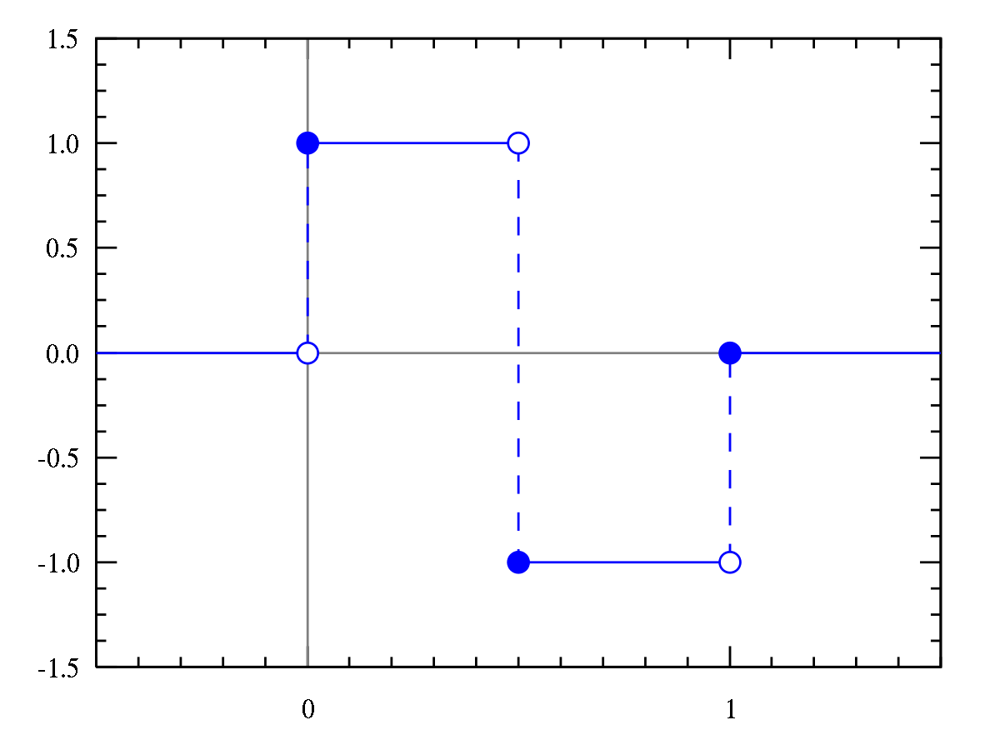
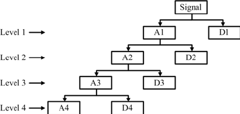
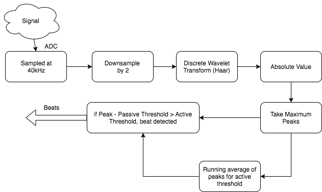
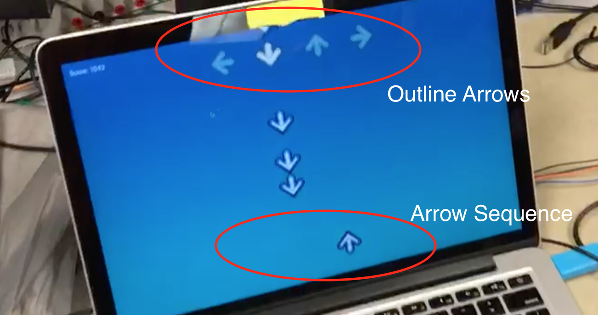
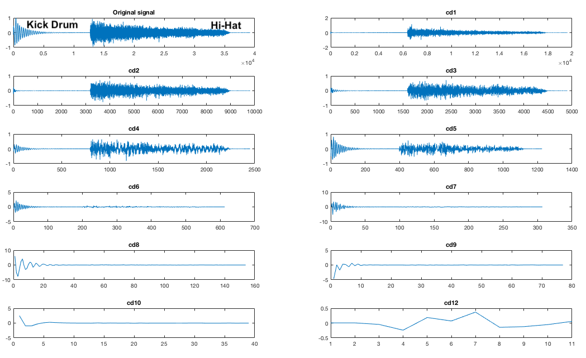
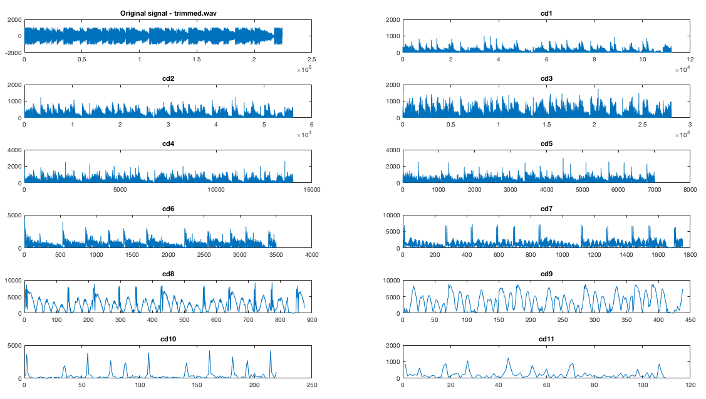
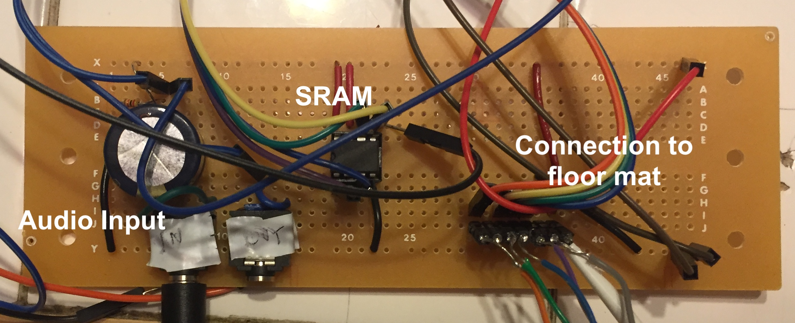
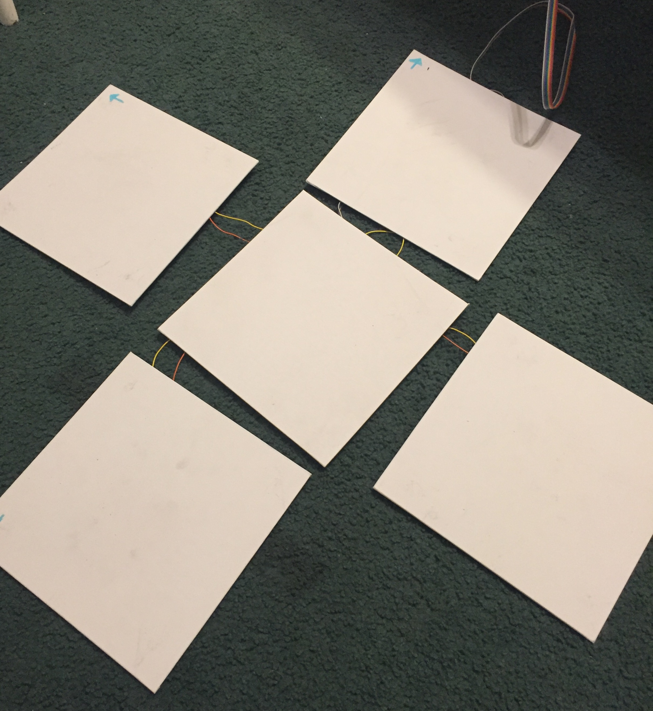

# Dance Dance Evolution

### Real Time Beat Detection, Audio Buffering, and User Input Using the PIC32

*Designed for ECE 4760: Digital Systems Design Using Microcontrollers*

*Drew Dunne (asd222) & Michael Solomentsev (mys29)*

---

### Background

We designed a version of the traditional arcade game 'Dance Dance Revolution' that synthesizes dance instructions from any audio source using the PIC32. Unlike the original game where you must select from a pre-chosen listing of songs, our device allows one to plug in audio of choice. The arrow instructions are then generated in real-time by buffering the audio and processing it using the discrete wavelet transform before putting the arrows on screen.

We were inspired by a mutual desire to work on a music related project, and both had fond memories of playing the game. We also wanted to add some sort of novel, interesting component, so we brainstormed the idea of having the player be able to play whatever song they wanted. This would make the game much more captivating and engaging. All versions of the game have pre-programmed song libraries, so replay value is ultimately limited. Our version has no such limitation. We used the discrete wavelet transform to efficiently analyze different frequency components of the signal at a discrete point in time. 


Figure 1: Our final system (missing power supplies)

---

### High Level Design

The system requires two kinds of user input: An audio source and button pushes from the floor tiles. It then must process those inputs, delay those inputs until processing is done, and display scoring and upcoming button press instructions on a screen. We use two PIC32s to do the aforementioned input processing (one detects beats and reads the dance mat input, the other buffers audio), and we use a macOS application to display the beats and handle scoring. 

#### Audio Input

We use each of the PIC32s' onboard analog to digital converter (ADC) to sample the signal from an audio jack at 40kHz. The signal is then processed on one PIC in 100 millisecond chunks (approximately 4000 samples) using a discrete wavelet transform (DWT) to determine whether a beat has occurred during that time segment. Because this takes a finite amount of time, we cannot simply play the recieved signal. Rather, we delay the sound using the other PIC and SRAM chip so that arrow instructions appear on the screen approximately 2.4 seconds before the player must press those buttons. The audio is delayed using a 128KB external SRAM, which interfaces with the PIC using serial peripheral interface (SPI) communication protocol. Upon sampling, 10 bit ADC data is truncated to 8 bits and sent to the SRAM. Once the SRAM's memory has filled up, every write is accompanied by a read. The read data is sent to the PIC's digital to analog converter (DAC), where it is played by a speaker. It was necessary to use two PIC32s because we simply did not have enough processing power on a single PIC to handle both buffering and signal processing. Interfacing with the SRAM chip at 40kHz took 60-75% of our CPU, and to try and process that data and have well-timed dance mat input reads was too much to squeeze into one PIC32. 

#### Beat Detection

The idea to use wavelet transforms came from a Cornell class ECE3250 (Mathematics of Signal and System Analysis), where Professor Delchamps discussed the topic briefly. As an overview - wavelet transforms are a way to quickly assess the frequency of components of a signal with a degree of time resolution. They are attractive to an embedded systems application like this one because they require relatively little calculations to compute. 


Figure 2:The Discrete Wavelet Transform (DWT)

The discrete wavelet transform (DWT), is performed on a discrete time signal using the mother wavelet, Ψ (see Figure 2). There are many different kinds of mother wavelets, but the easiest to compute is the Haar wavelet (see Figure 3). When the Haar wavelet is used, the math to compute each layer of the DWT is fairly simple, requiring only a few multiplies and adds. Moreover, it is recursive and extremely efficient. 



Figure 3: The Haar mother wavelet

The DWT outputs a series of coefficient values, which correspond to the energy of the signal at various frequencies. A signal of length L = 2^N will have N sets of coefficients. Each set of coefficients is calculated recursively from the previous set, so each has half as many elements as the set before (the first set has L/2 elements). Together, these can be used to reconstruct the signal, or, in our case, get a general understanding of its frequency components. Each layer of the transform (i.e., each set of the coefficients) represents a different scale of frequencies. The lowest layers of the transform (which have the most elements), represent the highest frequencies, and vice versa (see Figure 4). 



Figure 4: The DWT's process. AX are the approximate coefficients, which are used to calculate the next layer of the transform. DX are the detailed coefficients, used in our algorithm.

Our initial idea was to perform the wavelet transform, and then set threshold values for each set of coefficients. If the transform produced a value above those coefficients, a beat would be detected. Our final implementation was slightly different, and incorporated averaging to set better thresholds (see Figure 5).



Figure 5: A block diagram of our beat detection system

#### Dance Mat User Input

The floor tiles are built using Interlink Electronics' force sensitive resistors, where we have to resistors per tile (in parallel). Each tile functions as a simple voltage divider, where voltage spikes to approximately 3V on a press. We feed the outputs of these dividers to the PIC, where we have selected four pins to act as digital inputs. We send the pressed inputs and the desired arrow instructions to the Mac via UART. The PIC polls the dance mat for input approximately every 60 milliseconds. 

TODO: INCLUDE SCHEMATIC OF FLOOR TILES

#### macOS Application (Display)

Rather than building any sort of display, we chose to make an app for a Mac computer, so that it was easy to plug our device in and start playing. The Mac is connected by USB with a UART serial to USB cable (LINK HERE). The application is responsible for reading arrow sequences and currently pressed arrows from the PIC and displaying that accordingly. New sequences are added to the bottom of the screen, where they gradually move up to the top. At the top are faded outline arrows, which when they are pressed on the mat, they become fully opaque. The application is responsible for determining if the user properly presses the correct arrows at the time the current arrow sequence is passing by. The user recieves points depending on how well they time their presses.



---

### Software Design

#### macOS Application

As aforementioned, our Mac app reads from the PIC through UART. In order to achieve this we first had to install a driver to the specific serial cable bought for the project. We used one from Prolific, the link to the driver is [here](http://www.prolific.com.tw/US/ShowProduct.aspx?p_id=229&pcid=41). Once we could communicate to the PIC over UART, we need the mac application to be able to communicate through UART as well, and for that we used a framework called [ORSSerialPort](https://github.com/armadsen/ORSSerialPort). This framework allowed us to use a common pattern in Cocoa development called the delegate pattern. We used ORSSerialPort to create a ORSSerialPort object, which we set our app's view controller as the delegate for, and then an interface function implemented as part of the delegate pattern would be called every time there was new data to read. This made reading from the PIC very simple, as each time that method was called we knew more information had been sent from the PIC. The delegate method called by the serial port object in GameController is shown below.

```objective-c
// ORSSerialPort delegate method implementation
// Called every time new data is received from the serial communication. 
- (void)serialPort:(ORSSerialPort *)serialPort didReceiveData:(NSData *)data
{
  if (data.length > 0) {
    unsigned char byte = ((char *)[data bytes])[0];
    if (byte != 0) {
      // Actual game data received. invert bits.
      unsigned char in_arrows = ((~byte) >> 4) & 0xf; // User selected arrows. 
      unsigned char new_arrows = (~byte) & 0x0f; // Newly processed arrow sequence. 
      [[GameData sharedGameData] highlightOutlineArrows:in_arrows];
      
      // Prevents the counter from incrementing when there aren't really
      // new arrows to add. 
      if (new_arrows != 0) 
        [[GameData sharedGameData] addArrowSeq:new_arrows];
    }
  }
}
```

The application also displays the arrow sequences and user input, and this was done by adapting simple CoreAnimation game library developed by Matt Gallagher. This library offers simple game objects with the GameObject class, centralized game data with GameData class, and CoreAnimation layers for the game objects (GameObjectLayer class) all synchronized with NSTimers and Key-Value Observation. The game data starts a timer upon a new game which calls update functions for each game object currently in the data. Each time they object updates its properties, they value change notifies the game objects attached CoreAnimation layer object to update on the screen. The library was adapted for our arrow objects and the game data now sets a new game up with outline arrows and a score of zero. We also modified how objects were removed from the screen by using CATransactions rather than abruptly removing it, which was causing an odd lag as the arrows moved upwards. 

To combine the game view and the reading of the serial input, we had a view controller. Our app used another common Cocoa modeling called MVC, or Model-View-Controller. This idea keeps the model, or data, from interacting directly with the view. The controller handles the interaction between the two. Thus our controller would be the one reading from the serial port, and each time a byte had been sent from the PIC, it would parse those bits for the new arrow sequence as well as the currently pressed arrows. The controller would then instruct the game data to add new arrow objects to the screen and highlight the user arrows as necessary. One hiccup we came across was the serial port library on the Mac would trigger the delegate method with a 0 byte every other trigger. We could not figure out why this happend, so we had to develop a workaround. The solution was to send from the PIC all the data with the bits inverted, because it was rare that all 4 arrows would be pressed and that we'd be adding all four arrows in one sequence which would be the byte `0b11111111`. Hence flipping all the bits allowed us to ignore all 0 bytes, but everything essentially became active low. To handle the adding of the arrow objects and highlighting we defined the following functions inside the GameData class. 

```objective-c
// Highlights the specified outline arrows with the bottom four 
// bits of [highlights] being the Left-Down-Up-Right arrows.
// Also adds to the score based on how close the current sequence is.
// Removes current sequence from screen if scored. 
- (void)highlightOutlineArrows:(unsigned char)highlights;

// Called in new game, adds the half opacity outline arrows
// to the top of the screen to show user input.
- (void)addOutlineArrows;

// Adds a new arrow sequence to the bottom of the screen with 
// the bottom four bits of [highlights] being the Left-Down-Up-Right 
// arrows. Also assigns them an ID number from the running counter in 
// GameData. 
- (void)addArrowSeq:(unsigned char)sequence;

// A helper function for aligning the y-value of the arrows with the others
// in the same sequence (represented by the key).
- (void)alignHorizontalArrows:(unsigned char)sequence ForKey:(NSString *)key;
```

Inside of GameData, we have two counters running to keep track of the next sequence number to add and the current sequence number to hit. This allows us to grab the arrow objects by number and add new ones. We also have a score variable, which whenever updated we post a notification for the GameController to update the score label on screen.

On the PIC we have a simple thread running every 60 milliseconds which reads in the values of 4 input pins, checks if it is high, shifts it over a number of bits, and then ORs it into the byte to send. The code snippet below shows how we achieved this, where `arrows_to_send` is a pre-inverted arrow sequence generated from the wavelet transforms. 

```c
send_byte = 0; // byte to send
send_byte |= (mPORTBReadBits( BIT_7 ) == 0) << 4;
send_byte |= (mPORTBReadBits( BIT_8 ) == 0) << 5;
send_byte |= (mPORTBReadBits( BIT_9 ) == 0) << 6;
send_byte |= (mPORTBReadBits( BIT_13 ) == 0) << 7;
// Left-Down-Up-Right-0-0-0-0

// send the prompt via DMA to serial
send_seq = 0x0f; // base send_seq
if (should_send) {
  send_seq = arrows_to_send; 
  should_send = 0;
}
send_byte |= send_seq;
```

#### PIC32 1: Audio Buffering using External SRAM

The audio buffering was done with our second PIC, as the CPU cycles required for SPI communication with the SRAM chip were too many to fit any other processing alongside. We used our professor Bruce's code for the SRAM chip for reading and writing to the SRAM and writing to the DAC. His code included some read/write methods as well as handling the SPI setup and mode changes. We had to add code to read from the ADC in a timer interrupt, and then write to a location in the SRAM, and finally read from a different location and write that value to the DAC. 

```c
// Interrupt code (fires 40kHz)
adc_read = ReadADC10(0); // Reads ADC value
AcquireADC10();

ram_write_byte(w_addr, adc_read>>2); // Write the 8-bit ADC value
// Only read if there's actually data ready
if (r_valid) {
  ram_read = ram_read_byte(r_addr);
  dac_write_byte(ram_read<<4); // Writes to DAC channel A
}

w_addr += 1;
r_addr += 1;
if (w_addr == MAX_ADDR - 1) {
  // set r_addr to MIN_ADDR
  r_addr = MIN_ADDR;
  r_valid = 1;
}
if (w_addr > MAX_ADDR) {
  w_addr = MIN_ADDR;
}
```

To change how long we wanted to buffer the audio, we just needed to change the values of MAX_ADDR and MIN_ADDR. The closer together they were the smaller the range of the SRAM we wrote to, hence reading a previously written value sooner. This was important because using the entire SRAM gave us a buffer of about 3.3 seconds and we only wanted about 2.5 seconds. Thus after some testing we were able to find the correct buffer size to use. 

#### PIC32 2: Signal Processing and Beat Detection

See *High Level Design: Beat Processing* for an overview of the mathematics of the Discrete Wavelet Transform (DWT). The bottom line is that the DWT provides gives both frequency-resolution and time-resolution when we analyze a signal, and can be done extremely quickly. We use this to detect peaks in certain frequency in a signal, and detect beats if those peaks are above thresholds.

We first modeled our system in MATLAB, to ensure that this was actually possible on our scale. MATLAB has a wavelet library built in, so we used the existing DWT function to transform a variety of different signals. We first made sure that one could distinguish sounds of different frequencies using the coefficients. We were able to easily visually distinguish a kick drum and a hi-hat using the coefficients (see Figure 1, note that the scaling here is significantly off from our final scaling). The drum had higher coefficient values for the highest coefficient layers, and the hi-hat the lower layers, just as we expected.



We conducted a variety of tests on various signals, including frequency sweeps and snippets of real songs (see Figure 2). We constructed a mapping from each layer of the transform to the frequency that provoked the greatest response, and also recorded threshold coefficient values. This culminated in a script that would take in a signal, and note the times when beats were detected (see song_test.m, in Appendix B). This process was effective in further developing our beat detection method. We added in downsampling of the original signal by 2 and a rectification of the transformed signal. This script functioned as an effective proof of concept, and served us well as we moved forward.



We then began working to move the algorithm to C. We wanted to use or adapt an existing library for our purposes to maximize our efficiency. We initially used Rafat's wave library (see references), but found it too unwieldy. We then settled on the GNU Scientific Library, an open source scientific computing library. It had fairly good documentation online, and very easy to use functions. We did have to make several modifications, though. First, it is important to note that the GSL's notation is opposite from MATLAB's - i.e. higher coefficient levels have more entries and represent higher frequencies. This was fairly trivial though. We began by stripping the library of everything we did not need (2D wavelet transforms, wavelets besides the Haar wavelet, needless libraries, etc.). The most important priority was to modify GSL's DWT to no longer allocate any memory using malloc. We basically just allocate the memory beforehand by declaring variables of the necessary sizes to compute the DWT. The DWT is always computed on an array of length 2048, so arrays of constant sizes can be used. We also converted much of the calculations to integer math, becuase we did not need precision. We do have to cast to doubles for certain operations.

```c
int data[SAMPLE_SIZE];
int scratch[SAMPLE_SIZE];

static gsl_wavelet wave;
gsl_wavelet *w = &wave;

static gsl_wavelet_workspace workspace = { scratch, 2048 };
gsl_wavelet_workspace *work = &workspace;
```

Once the DWT algorithm was functioning, we began writing the actual beat detection code. We decided to perform the DWT approximately 10 times a second, so that we could get pretty good resolution for beat detection. Sampling at 40kHz, this worked out to about 4096 samples for each transform (the function requires an input array of length 2^N for some N). We downsample by 2, giving us 2048 samples and 11 layers of coefficients. When a buffer of samples fills, we compute the DWT. GSL's DWT returns the coefficients in one large array, so our absmax function takes in array indices and returns the maximum absolute coefficient value in that segment. This allows to find the peak of each coefficient layer.

We then take those peaks and compare them to our thresholds. We have two sets of thresholds for each coefficient layer, one active and one passive. If the absmax value is greater than active plus passive thresholds, a beat is detected. The passive thresholds were set due to testing trial and error. The active ones are essentially a running average of the past four or so absmax values from that coefficient layer, implemented through an approximation of an RC filter (`((old_val - new_val) >> 1) + ((old_val - new_val) >> 2) + new_val`). We then send the detected beats to the computer.

Note that we do not use all the different coefficient values, because some simply do not give us good beat detection and have significant noise.

```c
    cd1_val  = absmax(data,   2,   4);
    cd2_val  = absmax(data,   4,   8);
	...
    cd9_val  = absmax(data, 512, 1024);
    
    cd1_beat = cd1_val - cd_beats[0] >= CD1_THRESHOLD;
    ...
    cd9_beat = cd9_val - cd_beats[8] >= CD9_THRESHOLD;
    
    cd_beats[0] = RC_FILTER(cd1_val, cd_beats[0]);
    ...
    cd_beats[8] = RC_FILTER(cd9_val, cd_beats[8]);
    
    // Arrow generation
    arrows_to_send = 0;
    arrows_to_send |= (!(cd1_beat || cd4_beat)) << 0;
    arrows_to_send |= (!(cd7_beat || cd8_beat || cd9_beat)) << 1;
    arrows_to_send |= (!(cd5_beat || cd6_beat)) << 2;
    arrows_to_send |= (!(cd2_beat || cd3_beat)) << 3;
    
    if (arrows_to_send != 0b00001111) should_send = 1;
```

### PIC32 2: User Input

Taking input from the floor mats was extremely simple. Each tile functioned as an active high button, and each was polled approximately 15 times per second (every 60 milliseconds). Four pins are read in succession, and the output is sent as the upper 4 bits of the byte sent to the computer via the UART connection. 

```c
        send_byte |= (mPORTBReadBits( BIT_7 ) == 0) << 4;
        send_byte |= (mPORTBReadBits( BIT_8 ) == 0) << 5;
        send_byte |= (mPORTBReadBits( BIT_9 ) == 0) << 6;
        send_byte |= (mPORTBReadBits( BIT_13 ) == 0) << 7;
```

---

### Hardware Design

We used the PIC32 big development board, because it provided the best flexibility for development. It had the DAC already on board, and a variety of pins ready for use. Since we were already running significantly under budget, we had no incentive to cut cost and move to the small board. We also used a second PIC32 on the small board, rather than the large board, to hook up the dance mat through a protoboard. 

####Audio Circuitry

We soldered our audio circuitry on a protoboard to make it easier to debug and to reduce noise. This circuitry was extremely rudimentary. Our audio input jack fed into a 500uF capacitor to cut out any DC component, then we fed it in between two 10KΩ resistors sitting between 3.3V and ground to offset it, so that the ADCs could read it with no clipping. The DAC output was fed directly to an audio jack and speakers. 



#### Floor Tiles

The major consideration that affected our tile construction was a desire for resiliency. Since users would probably stomp on each of the tiles fairly hard, we wanted to make sure that our press detection system could withstand a lot of force. We also wanted a simple, easy solution to mock-up and build with minimal hardware knowledge. Initially we looked into using strain gauges, but they would require mounting to a base plate and the tile to be pushed. Traditional buttons did not seem like a robust enough option. Instead, we decided to use force sensitive resistors (FSRs). Initial testing revealed that the unpressed FSRs had resistance of approximately 6 MΩ, pressed was approximately 1KΩ. This huge discrepancy made it easy to probe it for a press. We contacted Interlink Electronics, and they were gracious enough to donate 10 FSR402s, making it possible for us to be under budget.

Because the FSRs were small in area (<1 inch square), we added two to each tile to increase the robustness of detection. We used a plywood plank as our first version of the tile, but found it to be a bit too heavy. We then used these canvas boards that were significantly lighter. We hot-glued 1/4-in nuts to each of the FSRs and placed them near the center along one diagonal of the board. We then hot-glued washers and nuts to each of the four corners. As a result of this setup, the resistors typically had no force applied to them, because they hardly rested on the floor. However, once depressed, the board bended slightly and the FSRs were squeezed. We wired the two resistors in parallel, then in series with a 10KΩ resistor. Running 3.3 V across the setup and measuring the voltage at the intersection point gave us voltage levels of basically 0V/3.2V when unpressed/pressed, which meant we could just wire up each tile to a digital pin. We constructed four of these, wired them up to a protoboard hidden underneath the center tile, then fed a ribbon cable up to our main protoboard.


*Our First Tile*



Our pinouts for each PIC (small and large board) are listed below. In total we used 16 pins. This does not include pins used for Vdd and GND. 

**Large Board**

| Pin            | Usage                         |
| :------------- | ----------------------------- |
| RPB3 (pin 7)   | ADC Input                     |
| RPB0 (pin 4)   | SRAM chip select              |
| RPB4 (pin 11)  | DAC chip select               |
| RPB5 (pin 14)  | SRAM MOSI (SPI channel 2 SDO) |
| RPB15 (pin 26) | SPI Channel 2 clock           |
| RPA2 (pin 9)   | SRAM MISO (SPI channel 2 SDI) |

**Small Board**

| Pin            | Usage             |
| :------------- | ----------------- |
| RPB3 (pin 7)   | ADC Input         |
| RPB7 (pin 16)  | Right arrow input |
| RPB8 (pin 17)  | Up arrow input    |
| RPB9 (pin 18)  | Down arrow input  |
| RPB13 (pin 24) | Left arrow input  |
| RPB11 (pin 22) | UART U2RX         |
| RPB10 (pin 21) | UART U2TX         |


---

### Results

#### General Usability

The final product was a success. The audio buffering worked extremely well, user input was clearly visible on the screen, beat detection was fairly good (see below section), and the Mac app accurately kept track of the score. Our floor tiles were somewhat difficult to use, because they felt very fragile to users who stepped on them. In order to prevent anything from breaking, much of the final testing was then done by stepping on the tiles while standing adjacent to the system (essentially being as delicate as possible). The game was definitely functional, though. Both team members found it exceptionally difficult to play the game because it was simply very hard. On the whole though, it was a successful, usable system. Here's a video of us playing the game (poorly).

https://www.youtube.com/watch?v=pRdD69pSOHk

####Beat Detection

The beat detection algorithm was remarkably successful. We tested using a variety of different music and different genres. Once the algorithm was implemented on the PIC and arrows were being sent to the monitor, we had a simple trial and error system of testing. In order to calibrate timing, we would play one drum beat, then measure the difference in time between when it played on the speakers and when the generated arrow reached the top of the screen. We adjusted the buffer size on the PIC and the speed of the arrows on the Mac to achieve synchronous behavior. Once this was done, we simply tried to play as much music as we could. Early attempts at this revealed that preset thresholds simply were not effective at doing beat detection between many different types of music. We then implemented an active averaging system to detect beats (see *Software Design: Signal Processing and Beat Detection*), which proved to be significantly more versatile.

Our algorithm is extremely effective at detecting beats and generating interesting arrow patterns when the music playing has distinctive low frequency components that manifest themselves in short beats. Playing classic rock and other music with loud, repetitive drums (AC/DC's Highway to Hell; Darius Rucker's Wagon Wheel) results in clear beat detection as soon as the drums kick in. Other sounds (guitar modulation, vocals, etc), result in variations in the arrow sequences. Our system also performs very well with electronic music (Mr. FInger's Mystery of Love; LCD Soundsystem's Dance Yourself Clean). These songs also have distinctive drums or quick base notes that make up the beat of the song. Since the base notes here are electronic, and can actually have a melody (as opposed to analog drums which are fairly constant in tone from hit to hit), they can result in really interesting, fun to play patterns.

https://www.youtube.com/watch?v=pbBUz9WgCM0

<https://youtu.be/TxRhZYfxWvQ>

As we expected at the onset of the project, certain genres of music did not work well for our system. We had two different types of failure cases. In the first case, no beats would be detected. This occurs when a piece of music is slower and has few cases of 'spikes in the signal,' so to speak. The Discrete Wavelet Transform essentially detects high energy transitions that look like the mother wavelet (see *High Level Design: Beat Detection*), and these are much less common in songs without modern bass. Classical music obviously fails to have beats detected. We also had poor results with jazz (Louis Armstrong, Dave Brubeck's Take Five). 

The other failure case we encountered was when too many beats were detected. This occurred primarily when base notes were too long, or the music simply had 'too much going on.' We consistently failed to generate anything remotely usable when playing hip-hop music, because long 808 bass notes caused our beat detection system to freak out, generating far too many notes. Quick hi-hats also resulted in many beat detections. This oversaturation made the game unplayable.

https://www.youtube.com/watch?v=3SJikKN0DuU

####Safety

Our project is something that users will physically interact with and use, so we needed to ensure user safety. All the exposed wires are perfectly safe to touch, because everything is at low voltages. We did have some concerns with user safety while stepping on the mat tiles. They were resistent to slipping on the floor surface we tested on (the linoleum tiles of Phillips 238), so that was not an issue. We hid all the wiring for the floor tiles beneath the boards so that users would not be able to trip and fall. The interface between the PIC and the floor tiles is one ribbon cable, and we made sure to put quite a bit of slack in it, so that users could get it out of their way while playing and minimize any hazard.

---

###Conclusions

Taken holistically, we were extremely pleased with the outcome of our project. The beat detection and arrow generation on certain songs was extremely good, and resulted in very playable patterns (see Results section). The application ran extremely well on the Mac, and user input using the pad was very straightforward. We attracted quite a lot of attention in the lab while demoing, which was extremely satisfying. Two areas for improvement stood out to us as we completed the project: A) Expanding our beat detection for more areas of music, and B) improving the floor tile system. 

Our beat detection was a fairly robust system, which was able to distinguish beats from music with simple beat structures and heavy drums (genres like classic rock and techno). As noted above, genres with heavy, longer basslines (for example, hip-hop with long, droning 808 bass), resulted in over detection and too many arrows appearing on screen. We talked about modifying either the PIC code or the Mac code to identify these longer basslines and display them on the screen as either one single beat, or an opportunity for the user to hold down one arrow pad. We ultimately decided not to do this because of the scale of the changes we would need to make. Future improvements to the system should certainly include this.

Perhaps the most obvious improvement necessary is to the floor tiles. While they technically did work - when someone placed their weight on a tile, the system would almost immediately (within 60 milliseconds) recognize a press. However, the tiles were simply too fragile (or seemed too fragile) to be used for the actual game. Each one was made out of a canvas board, propped up on the corners by metal nuts and washers. As a result, they felt very unsteady and breakable when a user put their weight on them. The center tile, where the user put their weight for the majority of playing time, was especially problematic because we chose to put the wiring protoboard underneath it. It felt like a jump on that page would result in the board snapping. It was thus difficult for anyone to actually play on the system. Moreover, the glue was indeed quite delicate, and we often had nuts and sensors fall off. We simply did not have time to revise our board design. If we were to improve the system, we could go in one of two directions. Either stiffen the boards by making them out of a sturdier material like wood (as our first, proof of concept board was), or get rid of the boards altogether, and make a mat-based system. We could still incorporate our force sensitive resistors (which worked extremely well), by putting some sort of light tile into the mat, so that the force of a step would be distributed onto the FSRs. Overall though, we were extremely happy with how our project turned out.

Our project is heavily inspired by the game Dance Dance Revolution, which is indeed a trademarked property. However, the name 'Dance Dance Evolution' has [no active trademarks associated with it](http://tmsearch.uspto.gov/bin/showfield?f=toc&state=4805%3Aq2zjoa.1.1&p_search=searchss&p_L=50&BackReference=&p_plural=yes&p_s_PARA1=&p_tagrepl~%3A=PARA1%24LD&expr=PARA1+AND+PARA2&p_s_PARA2=dance+dance+evolution&p_tagrepl~%3A=PARA2%24COMB&p_op_ALL=AND&a_default=search&a_search=Submit+Query&a_search=Submit+Query). In a sense, we did reverse engineer the mechanics of their game, but we could not find a specific patent for the game play mechanism. We do not think our beat detection algorithm/approach is novel enough to patent (see the Tzanetakis paper in our references). We reuse some code written by Bruce Land and Syed Tahmid Mahbub for the course. We also relied heavily on the GNU Scientific Library and Matt Gallagher's Core Animation library. Since our project is entirely open source and we are not seeking to mass-produce this for profit, we have no reason to believe we are violating any intellectual property.

We believe that our project is fully compliant with IEEE standards. We embarked on the project in an effort to bring an enjoyable, fun game to the masses, and that is ultimately what we ended up doing. Our project's individual components are all harmless: Floor switches, audio buffering, and beat detection. The IEEE code puts emphasis on protecting the public's health and safety. As a result we made special effort to make sure individuals do not trip or injure their feet when playing the game by putting the tiles low to the ground and making sure they would not slide around. As noted above, we do not think we are making any IP violations through the project. Even if our interpretation of the law is incorrect, we doubt that the publication of a single open source version of the Dance Dance Revolution game will cause the game publishers to lose any income. By making our code, schematics, and methodology publically available, we hope to encourage understanding of technology and spark interest in embedded design and signal processing, as per point five of the IEEE Code of Ethics. Moreover, we have noted all contributors and sources of code and ideas. In summation: Our project is fairly benign, and we hope it brings joy to all who play it.

We found no legal issues with our project. The only concern was that of intellectual property violations, and as noted above, we do not violate any trademarks. Our arrow image used in our project was taken from [DeviantArt](https://inkjuse.deviantart.com/art/DDR-Arrow-111309080). There was no license attached with the image. 

---

### Acknowledgements

We would like to heartily thank Interlink Electronics for their generous donation of 10 force sensitive resistors (part number FSR402). Their contribution made our project possible.

In addition, we are extremely grateful to Professor Bruce Land, who provided an immeasurable amount of help. Huge thanks also to Professor David Delchamps, whose lectures and advice inspired the signal analysis component of our project. Mark Zhao was a spectacular, well-informed TA.

---

### Appendix A: Permissions

The group approves this report for inclusion on the course website.

The group approves the video for inclusion on the course Youtube channel.

---

### Appendix B: Commented Code

All of our code and the projects are on GitHub [here](https://github.com/drewsdunne/ece4760-lab5). The most important files are linked locally below. 

- [lab5_wavelet.c](code/lab5_wavelet.c)
- [lab5_buffer.c](code/lab5_buffer.c)
- [wavelet.c](code/wavelet.c)
- [dwt.c](code/dwt.c)
- [haar.c](code/haar.c)
- [GameController.h](code/GameController.h)
- [GameController.m](code/GameController.m)
- [GameData.h](code/GameData.h)
- [GameData.m](code/GameData.m)
- [GameObject.h](code/GameObject.h)
- [GameObject.m](code/GameObject.m)

---

###Appendix C: Schematics

TODO EVERYTHING

---

### Appendix D: Budget

| Part                               | Quantity | Cost   |
| ---------------------------------- | :------- | ------ |
| Force Sensitive Resistors (FSR402) | 10       | $0.00  |
| Auxillary Audio Cord               | 1        | $1.74  |
| 10"x10" Canvas Boards              | 5        | $10.00 |
| PIC32 Large Development Board      | 1        | $10.00 |
| Serial to Serial Cable             | 1        | $5.00  |
| Jumper Cables                      | 21       | $2.10  |
| 6" Solder Board                    | 2        | $5.00  |
| 9V Power Supply                    | 2        | $10.00 |
| Lab Speakers                       | 1        | $2.00  |
| Header Sockets                     | 74       | $3.70  |
| PIC32MX250F128B                    | 2        | $10.00 |
| 23LC1024 SRAM                      | 1        | $2.32  |
| PIC32 Small Development Board      | 1        | $5.00  |
| MicroStickII                       | 1        | $1.00  |
|                                    |          |        |
| **TOTAL**                          |          | $67.86 |

---

###Appendix E: Work Distribution

Drew focused on:

* Serial communications
* Getting the SRAM to work
* Buffering audio
* Data transfer between PIC and Mac
* Writing the Mac app

Michael focused on:

* Prototyping and building all the floor tiles
* Soldering protoboards
* Testing and modeling wavelet transforms in MATLAB
* Finding and working with a suitable DWT library
* C implementation of beat detection

---

###Appendix F: References and Helpful Resources

Sources for DWT explanation images:

- [Acoustic Emission Signal Analysis by Wavelet Method to Investigate Damage Mechanisms During Drilling of Composite Materials](https://www.researchgate.net/publication/267333035_Acoustic_Emission_Signal_Analysis_by_Wavelet_Method_to_Investigate_Damage_Mechanisms_During_Drilling_of_Composite_Materials)
- [Encyclopedia of Multimedia - Discrete Wavelet Transform](https://link.springer.com/referenceworkentry/10.1007%2F978-0-387-78414-4_305)
- [Haar Wavelet](https://en.wikipedia.org/wiki/Haar_wavelet)

[George Tzanetakis' wonderful paper on beat extraction with the discrete wavelet transform](http://soundlab.cs.princeton.edu/publications/2001_amta_aadwt.pdf)

[Rafat Hussain's C Wave Library, which we didn't end up using, but may be a helpful resource](https://github.com/rafat/wavelib)

[The GNU Scientific Library](https://github.com/ampl/gsl)

[Datasheet for Interlink FSR402](http://interlinkelectronics.com/datasheets/Datasheet_FSR.pdf)

[Prolific Serial Driver](http://www.prolific.com.tw/US/ShowProduct.aspx?p_id=229&pcid=41)

[ORSSerialPort](https://github.com/armadsen/ORSSerialPort)

[Matt Gallagher's Core Animation library](https://developer.apple.com/library/content/documentation/Cocoa/Conceptual/CoreAnimation_guide/Introduction/Introduction.html)

[PIC32 Peripheral Library](http://ww1.microchip.com/downloads/en/DeviceDoc/32bitPeripheralLibraryGuide.pdf)

[IEEE Code of Ethics](https://www.ieee.org/about/corporate/governance/p7-8.html)

[Spotify playlist of songs that work well with our system](https://open.spotify.com/user/ikneadthis/playlist/3bhtbVHmOR9QFXgW1xDQiN)

[Our GitHub Repo](https://github.com/drewsdunne/ece4760-lab5)


